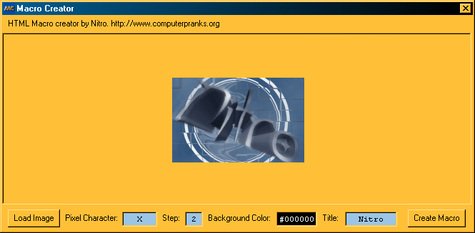



## Bitmap to HTML

### Description

Converts any bitmap, jpeg or gif image to a color html page.
 
### More Info
 
This program simply steps through each pixel of the image and uses a specified character(s) to create the image as a webpage.

makes IE run slow or freezes IE sometimes if the image is too large.

             |
---                |---
**Submitted On**   |2000-07-24 15:08:36
**By**             |[Calvin H, \(Nitro\)](https://github.com/Planet-Source-Code/PSCIndex/blob/master/ByAuthor/calvin-h-nitro.md)
**Level**          |Advanced
**User Rating**    |4.9 (44 globes from 9 users)
**Compatibility**  |VB 6\.0
**Category**       |[Internet/ HTML](https://github.com/Planet-Source-Code/PSCIndex/blob/master/ByCategory/internet-html__1-34.md)
**World**          |[Visual Basic](https://github.com/Planet-Source-Code/PSCIndex/blob/master/ByWorld/visual-basic.md)
**Archive File**   |[CODE\_UPLOAD81047242000\.zip](https://github.com/Planet-Source-Code/calvin-h-nitro-bitmap-to-html__1-10027/archive/master.zip)

